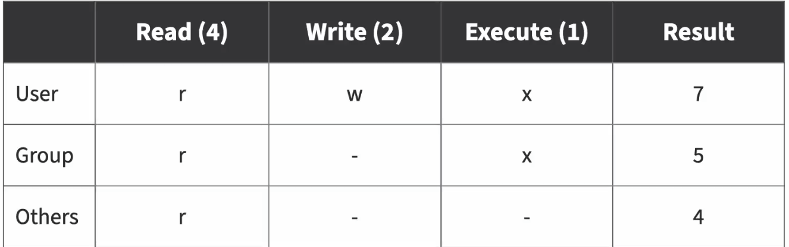
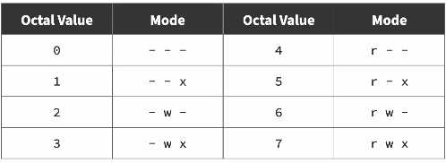
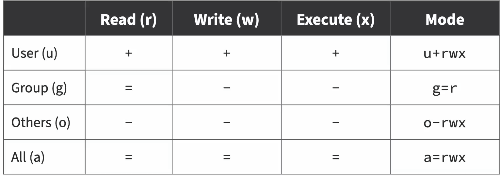
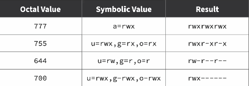
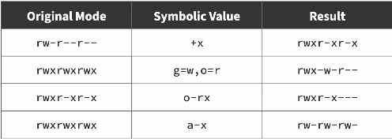
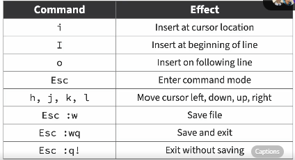

ls -l -a -h

-l -> long list of commands
-a -> shows hidden files too (all files)
-h -> show me size of files in human readable form
We can also do ls -ahl

- Action with two dashes have to bee written seperately

"Command" --help
-> Will give you the instructions of the command

# If you don't know them command use "apropos"

Ex - apropos list

- Use man to open a refernece page with specific command

# Shortcuts

ctr+A - Beginnning of line

- ctr+U - delete from cursor to start of the line

* Abosulte paths - begins with a slash which represents root directory
* Relative path

# pwd - prints working directory

# ls -l.-lh -> Shows more info of the files

- D - Indicates directory
- '-' - Indicates

# Stat "filename" - Gives the info of rhe file

# mkdir -p documents/legal/contracts

-> To create a directory inside documents and parent directory called legal and folder inside it called contracts

# cp - copy

- \ - used when there's a space in the name of directory, to indicate the shell its part of name

* we can also move it renaming into a different name

* '.' use a single dot at the end to move file to the working directory,
  mv p.txt .

# '\*' - Refers to all characters, if you wanna move .txt file, mv \_.txt (location)

# '?' - Refers to single character. if rm poems?.txt is used, whatever character after poems is removed, for ex, poems remains but poems2.txt, poems3.txt is removed.

# rm -r - Removed directories

# find . -iname "simple"

iname - for case insensitive, can also use name

-> Finds every character given in double quotes

find ~/documents/ -name "d"

# sudo -i -> Login directly as a root user

- rwxrwxrw -> first part - user, 2nd - group assigned permisssion, 3rd others

* Changing file permissions - Chmod,chown,chgrp

Octal (755,644,777)

Symbolic (a=r, g+w, o-x)

READ -4, W - 2, E - 1

# cat test.sh - OP the contents of a file

# Hard link

- point to specific data
- ln filename linkname

# Soft link

- points to a file
- ln -s simple.txt s -> filename to be converted and the link name

# echo - print the word metioned in quotes

# cat - concatenate

- cat -n - Numbers the lines

# head,tail - prints First and last 10 lines

- tail -n5, head -n5 - Display 5 no of lines

# less - use f and b for foward and backward

# grep - it is case sensitive

- -i - to ignore case sensitive
- -v - ignores search term
- -E - grep -E "[hijk]" filename.txt
  grep -E "\W{6,}"

# awk - extract data from a file according to a rule, specificallly designed to use with rows amnc columns

awk '{print $2}' filename
awk '{print $2"\t"$1}' filename

awk '{print $2"\t"$1}' filename | sort -n --> sort acc to numeric data

# sed is mainly used to find, replace, delete, or modify text line by line in a file or command output.

sed s/John/Peter/ simple.txt

sort -k2 simple.txt --> k is key which represents column

-u --> unique to ignore duplicates

rev - reverse sequence

# tar is used to bundle multiple files and folders into one archive file.

* tar -cvf files.tar simple.txt notes.txt
c - create
v - verbose - list out contents of a file
f - op archive to file
a - what kind of copmression to use

* To extract it:

tar -xvf files.tar

# ZIP - njoed@JOE:~/learning-journal$ zip -r exfiles.zip week-1/
updating: week-1/ (stored 0%)
  adding: week-1/image.png (deflated 7%)
  adding: week-1/t (deflated 19%)
  adding: week-1/simple.txt (deflated 42%)
  adding: week-1/poems2.txt (stored 0%)
  adding: week-1/image-5.png (deflated 4%)
  adding: week-1/poems.txt (deflated 50%)
  adding: week-1/linux-commands.md (deflated 53%)
  adding: week-1/myfiles.tar (deflated 100%)
  adding: week-1/image-4.png (deflated 4%)
  adding: week-1/test.sh (deflated 19%)
  adding: week-1/image-2.png (deflated 3%)
  adding: week-1/newnano.txt (stored 0%)
  adding: week-1/image-3.png (deflated 4%)
  adding: week-1/image-1.png (deflated 3%)

  # PATHG - list of directqries in file system wher shell is told to look for programs or executable files outside working directory.

  * Edit shell profile at ~/.bash_profile 
  
  * ls -lah --> a gives out hidden files